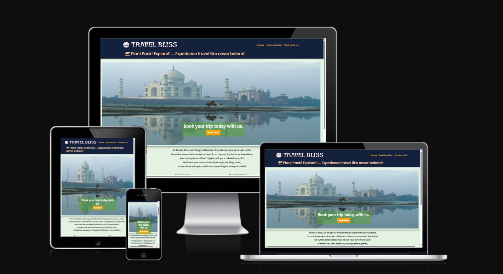

<h1 align="center">TRAVEL BLISS </h1>

[View the live Project here](https://jyotihambir-bc.github.io/travel-bliss/)

## User Experience (UX)
### Use Stories
* As a site visitor I can easily see the purpose of the site from the landing page so that I can see if the site is relevant to my needs.
* As a site visitor I can view a list of all options on destination page so that I can see the available options blogs.
* As a site visitor I can click on a click button so that I can navigate the specific destination page.
* As a site visitor, I can click on read more button so that I can get more information about the destinations / places.
* As a site visitor, I can click on book now button so that I can navigate to booking form.
* As a site Visitor, I can see the booking form available on contact page so that I can fill up my information and submit that.
* As a site visitor, I can get the confirmation message after submitted the booking form so that I can be assured whether my enquiry is successfull or not. 

[Project Board](https://github.com/users/JyotiHambir-BC/projects/12)
- Used kanban board for write user stories in github

## Features

- ### Existing Features
  
  - _01 Home Page Images_
  
  

  - _02 Destination Page_
  
  

  - _03 Destination Insight Page_
  

  - When Click on **Read More** Button you will navigate to following information:
  

  - When Click on **Book Now** Button you will navigate to contact page:

  - _04 Contact Page_   
  

  - 05 Booking Form Submit Confirmation_
    - When Click on **Submit Button** after filled the booking form you will get following confirmation message:

  
      
   
### Features which could be implemented in future
- A Search Button on all pages so that visitor don't need to go through manually searching for all the options  
  
## Technology Used

### Language Used
* [HTML 5](https://en.wikipedia.org/wiki/HTML/)- Used to structure all the templates on the site
* [CSS 3](https://en.wikipedia.org/wiki/CSS)- to provide extra styling to the site
* [JavaScript](https://www.javascript.com/)- Minimum javascript was used to generate the message pop-up after user submit the booking form.

### Frameworks, Libraries
* [Bootstrap 5](https://getbootstrap.com/) Used to add style in HTML code
* [Google Fonts:](https://fonts.google.com/) used for the Poppins and Protest Guerrilla font
* [Font Awesome:](https://fontawesome.com/) was used to add icons for aesthetic and UX purposes.
* [Coolors:](https://coolors.co/palettes/trending) was used for choose the colours for website.

## Testing

### Test Cases and Results
  - Testing has taken place continuously throughout the development of the project. Each view was tested regularly.

## Deployment

## Bug

**Bug 01 :** 
In booking form when clicking on submit button the successfully submitted message displaying, even the form is not filled.  

**Solution :**
Add if condition in javaScript for checking the form validity and if form is not valid then show the error message. After that it working as expected.

-----------------------------------------------------------------------

### How this site was deployed

  - In the GitHub repository, navigate to the Settings tab, then choose Pages from the left hand menu 
  - From the source section drop-down menu, select the Main Branch
  - Once the main branch has been selected, the page will be automatically refreshed with a detailed  ribbon display to indicate the successful deployment
  - Any changes pushed to the main branch will take effect on the live project.

  The live link can be found here - [Travel Bliss](https://jyotihambir-bc.github.io/travel-bliss/)

## Credits
- [Unsplash](https://unsplash.com/s/photos/travel) for downloaded images for cards.
- [Google](https://www.google.com/) for downloaded images for cards.

## Learning Resources
- [W3CSchool](https://www.w3schools.com/)
- Other open source to understand and solve different types of error : ChatGPT, Stack Overflow

### Acknowledgments
I would like to acknowledge the following resources and technologies that helped in building this project:

- HTML, CSS, JavaScript – Core technologies used for development.
- Bootstrap 5 – For responsive design and UI components.
- Google Fonts & Font Awesome – For typography and icons.
- Unsplash/Pexels – For high-quality free images used in the project.
- MDN Web Docs & W3Schools – For reference and learning.
- ChatGPT – For debugging assistance and development guidance.
- Special thanks to my friends and family for their support and feedback during development.
 

  